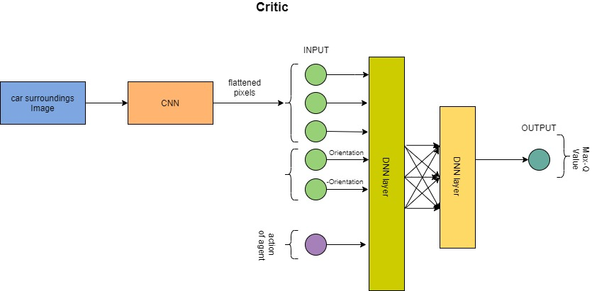

# EndGame-Assignment

## Implementation of self driving car using TD3 algorithm

# Training self driving car on TD3 deep reinforcement learning algorithm 

## Summary of what is done 
- Added CNN to calculate state from image
    - replaced the sensor input with cropped & rotated Image input
- Inputting the orientation of the car to neural network
    - __NOTE__ : Please refer to Actor and Critic Images to understand better
    - Without orientation car was stumbling here and therewhile staying on road. 
    - So added orientation to acknowledge the agent to reach destiny
- Shifted the entire update operation to car.py from brain.update()
    
    
__NOTE__ : I still kept some of the old code commented without deleting. So that reader can find it easy to correlate the old code with the new one

## Observations
- After training with this code car was able to understand how to keep itself on roads. But was unable to learn how to reach destiny
- tweaking the reward and environment and done conditions should give better results\
__NOTE__ : I dont have GPU so I was unable to do much hyper parameter tuning

## Improvements (that can be done)
- tweak the parameters

__Refer__ [this](https://youtu.be/2h8b4orhTT4) link to see some video of how car was training.
- These are some small instances of recording while the model was training.
- It can be clearly observed that the model is trying to stay on road while not very confident about reaching the destination

__NOTE__ : I have recorded the video before removing the sensor image (dots infront of car) .Apologies for that
 
 
 ### New Actor model
 
 
 ### New critic model
 
