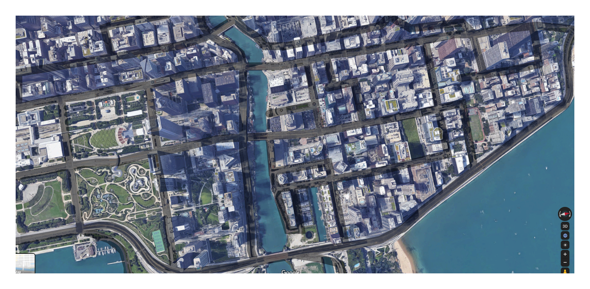

# EndGame-Assignment

## Implementation of self driving car using TD3 algorithm

# Training self driving car on TD3 deep reinforcement learning algorithm 
I have divided entire training of agent into 2 phases
- phase 1
    - train the car without roads so that it can learn to move across targets
- phase 2
    - once it starts moving across targets add roads to the environment. now agent will try to figure out how to move on roads 

## Summary of what is done 
- This notebook mainly consists of changes required for two-phase-learning
- This can be effectively described as the following figure

- Added padding to the images. For making the concept of walls more concrete to the agent

## Detailed explanation :
- divided images into two parts for two phases of learning. Images can be founf in __images/__ folder
- For phase 1 i have removed roads below

- you can see that all the image is road and the agent can roam anywhere and the border is white which give a negative reward if gone too close to walls also done condition is set
- Did same thing for mask_white.png
- "\_white" at the end of image refers to thre are no roads in the image
- for phase 2 I have added roads and converted the area with buildings and water into grey 
    - Did this in order to set differentiation between Buildings and walls
    - In simple terms white means cannot go at all -> grey means should not go but can learn not to go -> black means can go 
 
 - did the same for mask.png
 - finally added padding to the city.png
 
 - __NOTE__ : _white border may not be visible_ on the images because the background of website is also white
 - All these images can be gnerate by running ___white_image_save.py___. Makse sure you have original images on assignment 7 in the images folder before running ___white_image_save.py___
 
- Once this is done start training by running __map.py__. 
- Once the agent lern to move across the targets click on add button on the UI. This adds roads to the environment

- Look at the below diagram to again. It will summarise the entire process

## I will try the following in the future:
- will try to improve the phase-2 of learning

I believe that trying these things out will defenitely open gates for new ideas and intutions and Improve the model further

 ### New Actor model
 
 
 ### New critic model
 
